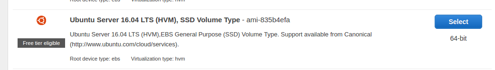

# ec2-docker
##### Provisioning a Docker example running on an EC2 fresh instance.
 
 
### Creating the EC2 ubuntu instance
 1. Go to your EC2 console and launch an Ubuntu Server instance.
 
    
    
 2. There will be some steps when creating it. They won't make difference to this example.
    Be careful with the last step 6 so it's related to security group and public keys.
    You must have some knowledge about how this works otherwise you'll have access issues.
    
    
    
 3. If you did not make anything on security groups ports configuration then you'll see
    a warning about the ssh port open to world (0.0.0.0/0). Don't worry about this now as
    you can come back later to arrange it.
    
 4. Create or choose a key pair in order to access the instance with SSH public key.
    Keep your key in a reasonable place as ~/.ssh/  for example
    
 5. Go to your EC2 console to check if the instance is already running.
 
    
    
 6. You can now access the instance via SSH using the your generated public key (the-name-you-gave.pem).
 
    `user@local$ ssh -i path-to-my/the-name-you-gave.pem ubuntu@your-ec2-ip.your-zone.amazonaws.com`
    
    ps: here you can face problems if your public key has too wide permissions (chmod 600 on it to solve) 
    
    
 ### Installing Docker on the previous created Ubuntu instance.
 
 Supposing you are now logged in the previously created Ubuntu instance, let's make the basic steps
 to install Docker CE on it. Be careful with the ubuntu version numbers and repositories addresses as
 they can change with time. **Be careful copying and pasting multiline comands**.
      
   1. Install some required tools as curl , etc.
      
      ```
         sudo apt-get install \
                apt-transport-https \
                ca-certificates \
                curl \
                software-properties-common
      ```
 
   2. Get the GPG Key. Should show OK if successful 
     
        `curl -fsSL https://download.docker.com/linux/ubuntu/gpg | sudo apt-key add -`
    
   3. Verify the fingerprint
   
        `sudo apt-key fingerprint 0EBFCD88`
     
   4. Setup the stable repository. Notice that you are specifying Ubuntu distro, architecture and version.
      It's been used stable but you could use either release or test. If successful nothing will be shown.
      ps: lsb_release -cs is used to provide the distro name.
   
      ```
      sudo add-apt-repository \
       "deb [arch=amd64] https://download.docker.com/linux/ubuntu \
       $(lsb_release -cs) \
       stable"

      ```
      
   5. Apply the changes by updating the repositories. You'll see something related to docker being shown.
       
      `sudo apt-get update`
      
   6. Finally install Docker CE.
   
      `sudo apt-get install docker-ce`
      
   7. Verify that Docker has been correctly installed.
   
       `sudo docker run hello-world`
       
   If you were successful so far this is what you're seeing on terminal.
        
   