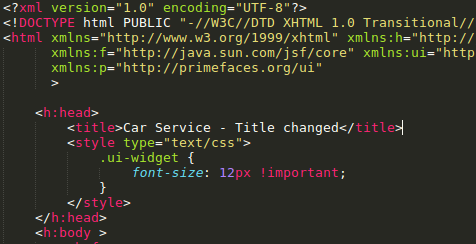

## Republishing a jar artifact into a Docker's running  container.

After going through Docker's main concepts, let's do a more practical exercise. We're going to run a web application
on a container.Then we'll change the web application artifact by doing some changes on the source code and republishing them.
 
#### Running the previously created Wildfly's car-service. 

1. If you have not removed the wildfly-app yet, you just need to run it. Let's follow the steps again so we can see how simple is to do that:

    $`mkdir car-service && cd car-service`

    $`echo FROM jboss/wildfly >> Dockerfile`

    $`scp -i ~/path-to/the-name-you-gave.pem car-service.war ubuntu@your-ec2-ip.your-zone.amazonaws.com:/home/ubuntu/car-service/`

    $`echo ADD car-service.war /opt/jboss/wildfly/standalone/deployments/ >> Dockerfile`

    $`sudo docker build --tag=wildfly-app .`

    This will show the build being done.
    
    
    
    
    You may have noticed the highlighted ID's. You'll see on the step 1 that jboss/wildfly is pointing to a local image.
    If that image weren't available locally, you'd see it being pulled from Docker repo instead.

2. Ok, now check the created image list:

    $`sudo docker images`

3. Run the image on 8080 port. Let's do it now using -d "detached" to keep using the same bash terminal:

    $`sudo docker run -d -it -p 8080:8080 wildfly-app`

    You'll see the process ID if it worked.

4. Checking the container status:

    $`sudo docker stats`

#### Changing the war file content.

Now let's go back to our local filesystem to change something inside the war file just to help accomplishing this example.
Open the war file with any unzip tool as archive-manager for instance, if you're using an Ubuntu distro.
Extract the file index.xhtml to any folder. Open it from a text editor and change something simple enough to not cause deployment issues.
I'll change just the title html property.

1. Now update the jar file content. I'm using the simplest way to update but there are several ways to do that (maven, vim, jdgui, etc).
 
    $`/usr/local/java/jdk1.8.0_111/bin/jar uf car-service.war index.xhtml`

    PS.: To checksum war files in order to confirm identity `md5sum file.war` can be used.

    

2. Now copy the changed war file to EC2 instance:

    $`scp -i ~/path-to/the-name-you-gave.pem car-service.war ubuntu@your-ec2-ip.your-zone.amazonaws.com:/home/ubuntu/car-service/`

#### Updating the container content and republishing it.

Let's come back to EC2 instance bash and copy the new war file into the container.

1. Go to the car-service project folder where the new changed war file is.

    $`cd /home/ubuntu/car-service`

2. Copy the artifact into the container using [previously](images-containers.md) seen tools.

    $`sudo docker cp car-service.war [CONTAINER_ID|CONATINER_NAME]:/opt/jboss/wildfly/standalone/deployments/`

3. Go to the browser to check your changed file.

    
    
    
    
[<- Back](README.md)

 

