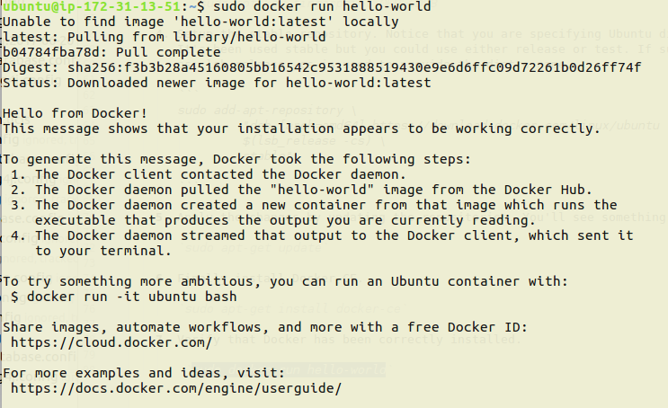
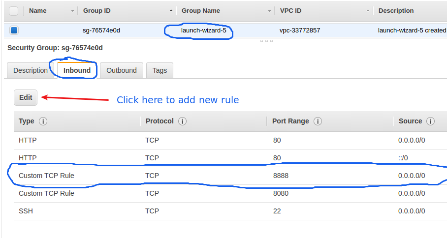
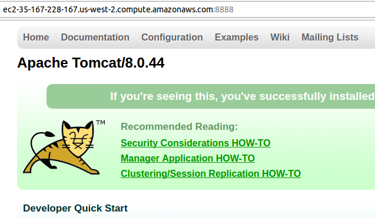

### Installing Docker on the previous created Ubuntu instance.
 
 Supposing you are now logged in the previously created Ubuntu instance, let's make the basic steps
 to install Docker CE on it. Be careful with the ubuntu version numbers and repositories addresses as
 they can change with time. **Be careful copying and pasting multiline comands**.
      
   1. Install some required tools as curl , etc.
      
      ```
         sudo apt-get install \
                apt-transport-https \
                ca-certificates \
                curl \
                software-properties-common
      ```
 
   2. Get the GPG Key. Should show OK if successful 
     
        `curl -fsSL https://download.docker.com/linux/ubuntu/gpg | sudo apt-key add -`
    
   3. Verify the fingerprint
   
        `sudo apt-key fingerprint 0EBFCD88`
     
   4. Setup the stable repository. Notice that you are specifying Ubuntu distro, architecture and version.
      It's been used stable but you could use either release or test. If successful nothing will be shown.
      ps: lsb_release -cs is used to provide the distro name.
   
      ```
      sudo add-apt-repository \
       "deb [arch=amd64] https://download.docker.com/linux/ubuntu \
       $(lsb_release -cs) \
       stable"

      ```
      
   5. Apply the changes by updating the repositories. You'll see something related to docker being shown.
       
      `sudo apt-get update`
      
   6. Finally install Docker CE.
   
      `sudo apt-get install docker-ce`
      
   7. Verify that Docker has been correctly installed.
   
       `sudo docker run hello-world`
       
   If you were successful so far this is what you're seeing on terminal.
        
   
   
   ### Further advanced steps
   
   Ok , now we got a Docker running on AWS EC2. It's nice but nothing useful so far.
   Let's try go beyond hello world.
   
   1. Run a Tomcat instance from Docker hub just doing:
        `sudo docker run -it --rm -p 8888:8080 tomcat:8.0`
      You'll see the tomcat log on the console. Leave it running for a while.
        
   2. Try to access using a browser http://your-ec2-ip.your-zone.amazonaws.com:8888.
      You probably had a problem doing this. It's because the port 8888 is not open
      to inbound connection. Let's look back to item 2 of EC2 creation when we just
      left it as default.
      
   3. Go to the security group related with your running instance.
      
      
   4. After add the port rule for the running Tomcat try again: http://your-ec2-ip.your-zone.amazonaws.com:8888
      
      
   [<- Back](README.md)