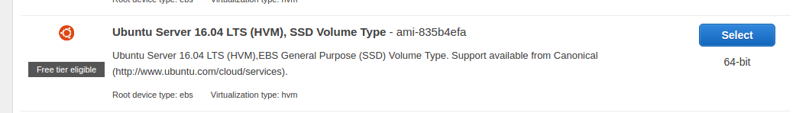
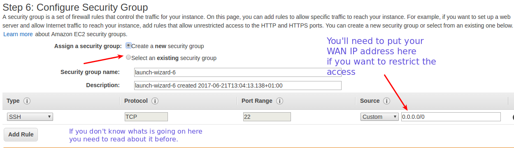
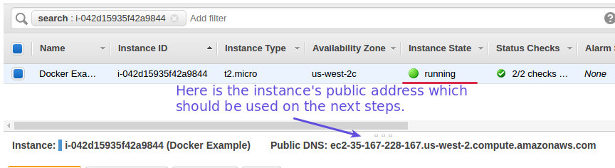

### Creating the EC2 ubuntu instance
 1. Go to your EC2 console and launch an Ubuntu Server instance.
 
    
    
 2. There will be some steps when creating it. They won't make difference to this example.
    Be careful with the last step 6 so it's related to security group and public keys.
    You must have some knowledge about how this works otherwise you'll have access issues.
    
    
    
 3. If you did not make anything on security groups ports configuration then you'll see
    a warning about the ssh port open to world (0.0.0.0/0). Don't worry about this now as
    you can come back later to arrange it.
    
 4. Create or choose a key pair in order to access the instance with SSH private key.
    Keep your key (.pem file) in a reasonable place as ~/.ssh/  for example
    
 5. Go to your EC2 console to check if the instance is already running.
 
    
    
 6. You can now access the instance via SSH using the previously generated public key (the-name-you-gave.pem).
 
    $`ssh -i path-to-my/the-name-you-gave.pem ubuntu@your-ec2-ip.your-zone.amazonaws.com`
    
    ps: here you can face problems if your private key has too wide permissions (chmod 600 on it to solve) 
    
    
  [<- Back](README.md)