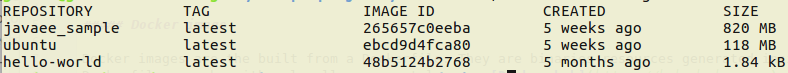
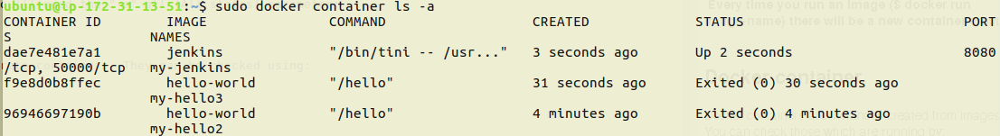

## Images and containers concepts.

After doing basic use and deployment this is a good time to go further on 2 concepts: image and container.

### Docker image

Docker images are built from a Dockerfile. They are binaries resources generated inside the host.
Dockerfiles can be either locally or remotely eg.: [Docker hub](https://hub.docker.com) 

The first useful tool to manage your Docker army is:

   $`docker images`

which will be printed out as:

It shows the most recently created images. If you want to see ALL of them, the parameter "-a" will be necessary.

   $`docker images -a`

This will print out some images tagged as "none" from repository "none". They were created as a children dependency from another
image that was either built or pulled. Some of them are being used by other images. The ones not being currently used are bad.
Those are called [**dangling**](http://www.projectatomic.io/blog/2015/07/what-are-docker-none-none-images/) images. 
You can check for dangling images by using:

   $`docker images -f "dangling=true"`

If you want to remove all dangling images for instance, you can use *docker rmi* tool followed by the filter parameter "-f":
 
   $`docker rmi $(docker images -f "dangling=true" -q)`  

PS: -q is the "quiet" mode for listing images. This will show a list of ID's instead of all image details.

Those were the most used image tools. You can check an image details passing his ID/REPOSITORY value:

   $`docker image inspect [IMAGE ID | REPOSITORY]`

Check more tools using the "-h" help parameter
 
   $`docker image -h`    

   $`docker images -h` 

Running a container from an image. You can try "jenkins" as image name for example:

   $`docker run [image-name]` 

Docker will create a generated name for the container unless you specify it.

   $`docker run --name my-name [image-name]`

Running the image as a detached (background) process.

   $`docker run -d [image-name]`

This will print out the process id and exit to bash.

**Every time you run an image ($ docker run image-name) there will be a new container created.**

### Docker container

Docker containers are instances created from images. You can check those which are running by:

   $`docker ps`  

It could be also: 

   $`docker container ls`

If you want to see *ALL* containers you'll need the "-a" all (All states) parameter:

   $`docker ps -a`

There are more tools available to operate containers. They can be checked using:

   $`docker container -h`

Addendum: many docker container tools works in the same way when ommiting the world container.

   $`docker rm [CONTAINER_ID|CONTAINER_TAG]` *does the same as* `docker container rm [CONTAINER_ID|CONTAINER_TAG]`

But not aways:

   $`docker ps` *does the same as* `docker container ls`

Removing exited containers using the filter parameter (aways test the inner filter before apply the remove tool):

   $`docker rm $(docker ps -a -f "status=exited")`

Stopping a running container:

   $`docker stop [CONTAINER_ID|CONTAINER_TAG]`

Stopping all running containers:

   $`docker stop $(docker ps -a -f "status=up")`

Starting a container:

   $`docker start [CONTAINER_ID|CONTAINER_TAG]`

Logging into container's bash.

   $`docker exec -it [CONTAINER_ID|CONTAINER_TAG] bash`

Copying stuff from local into container.

   $`docker cp local_file.ext [CONTAINER_ID|CONTAINER_TAG]:/home/any/path-you-want-to-paste`
    
    
[<- Back](README.md)

