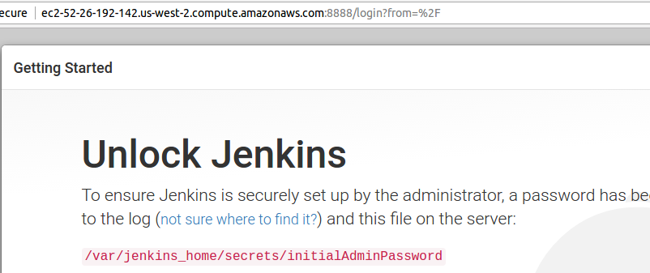
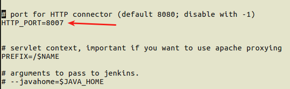

## Installing Jenkins on a EC2 instance.

### Doing the usual Jenkins installation.

This installation will be done as a *linux service way*. There are many different ways to run Jenkins as: using Docker
, executing a .jar file and others. That means a script will be created under /etc/init.d/ which contains the basic
parameters. The Jenkins is going to be managed as:  `sudo service jenkins [stop|start|restart]`

1. Download and add the Jenkins repo key.

	$`wget -q -O - https://pkg.jenkins.io/debian/jenkins-ci.org.key | sudo apt-key add -`

2. Add the Jenkins repo on sources list then apply the update.

	$`echo deb http://pkg.jenkins.io/debian-stable binary/ | sudo tee /etc/apt/sources.list.d/jenkins.list`

	$`sudo apt-get update`

3. Install Jenkins

	$`sudo apt-get install jenkins`

4. Check if and where Jenkins is running by either listing services or going to a browser.

	$`sudo lsof -i -n -P | more`

	or even checking the status:

	$`service jenkins status`

PS: If you are running it on a EC2 instance, be aware of security group ports allowance. Go to the security groups inbound tab
to check if the running Jenkins port matches EC2 permissions.
 
### Jenkins initial setup.

Now if Jenkins is running without problems and you went to the browser you can see an unlock Jenkins screen.

 

1. As shown on that screen, pick up the initialAdminPassword. Follow exactly the showed path as it may vary. 

   $`sudo cat /var/lib/jenkins/secrets/initialAdminPassword`

2. Click to install recommended plugins and wait. After that you be asked to fill a user form. Save it and finish.

### Optional:  Changing Jenkins port and JVM configurations.

You may have problems if your Jenkins is running at the same port as other service. You can customize Jenkins setup
using its config file.

1. Open Jenkins config file with your prefered editor.

   $ `sudo nano /etc/default/jenkins`

It shows all Jenkis variables as well as what they do.

2. Change the HTTP_PORT variable to the new value.

 

3. Restart Jenkins service.

   $`sudo service jenkins restart`

4. Ensure the port Jenkins is running on.

   $`sudo lsof -i -n -P | more`

