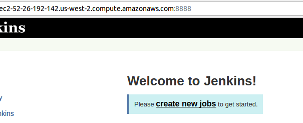
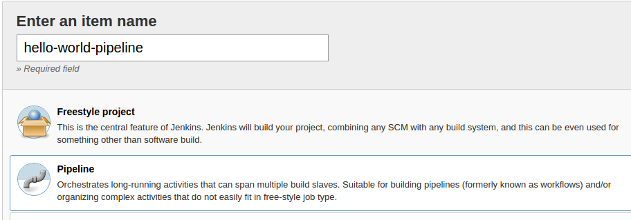
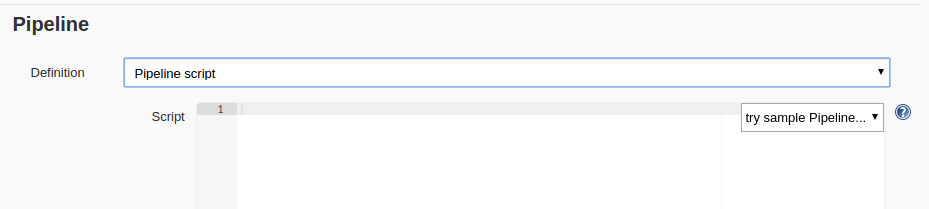
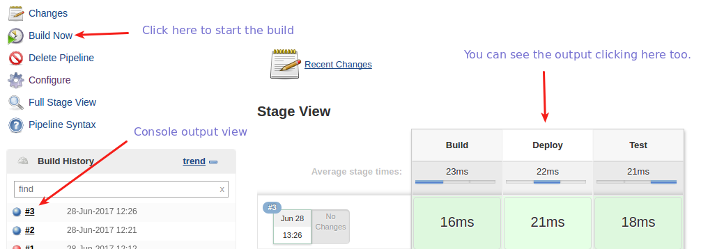

## Running an example of Jenkins pipeline.

Jenkins pipeline represents the continuous integration high level steps to build, deploy and test
an application. Everything done until now was to provide this high level configurations.
From Jenkins pipeline you can do many things as: Managing EC2 instances via AWS plugin, managing Docker images, checking out source code from SCM (svn, git, etc), managing Maven , Gradle , SBT builds,  run bash , controlling quality control on deliveries and thousands of possibilities.   

It's worth taking a look on [Groovy platform](https://www.tutorialspoint.com/groovy/index.htm) if you're not familiar. It's quite similar to Java as it was based on that platform. 

Let's start as simple as possible to avoid being dizzy around too many information.


### Running a hello world pipeline job.

1. Create a new Jenkins pipeline job.



--------



2. Go to the Pipeline section by scrolling down or clicking the tab. 



3. Place the small script and save it.

```
node {
    echo 'Started my pipeline job'
    stage("Build") {
        echo 'Building code here ...'
    }
    stage("Deploy") {
        echo 'Deploying artifacts here ...'
    }
    stage("Test") {
        echo 'Run the tests ...'
    }
}
```
4. Run the build and wait for the console output appear. Then click on it to see.




[<- Back](README.md)