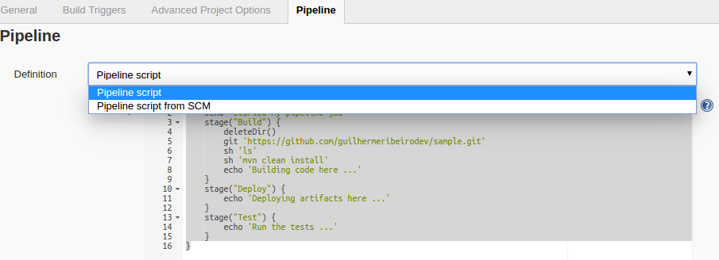
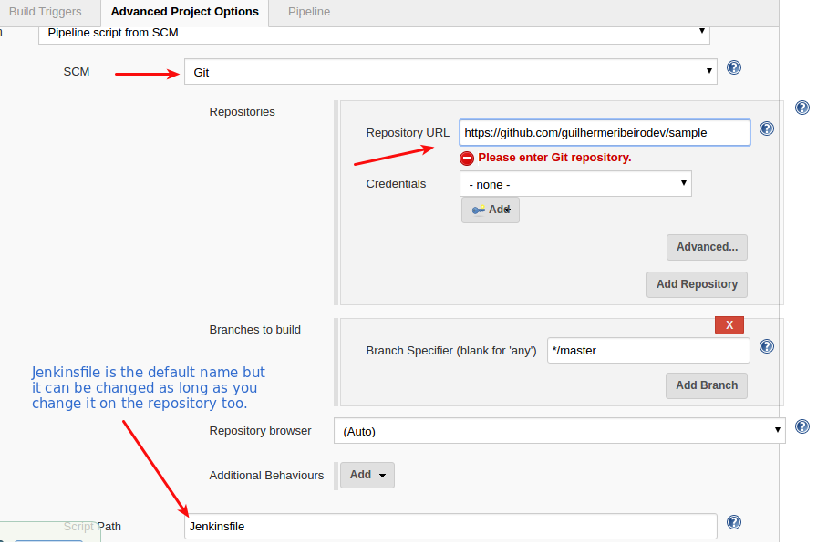

### Jenkinsfile placed on code repository

Having a Jenkinsfile on the project root is better than write scripts direct into Jenkins pipeline.
It's more maintanable and easy to change as it's not needed to go to Jenkins dashboard.

Basicly, everything it's needed is to put the same pipeline script into a file called Jenkinsfile which should live on the project root .

We'll make just a few steps to improve our pipeline.

#### Preparing the Jenkins pipeline to work automated.

1. Go to the previously used pipeline script. Copy its content to a new file called [Jenkinsfile](https://github.com/guilhermeribeirodev/sample/blob/master/Jenkinsfile) (upper J) then place it into the root of your code repository.

1. Came back to the pipeline now to change the pipeline type to "Pipeline script from SCM":

	

1. Configure the SCM field selecting Git and fill the required fields.

	

1. Change the "git url" line to "checkout scm" and commit into the repository.

```
	stage("Build") {
        deleteDir()
        checkout scm
        sh 'ls'
        sh 'mvn clean install'
        echo 'Building code here ...'
    }
```

1. Run the build again. The results must be the same as when it's direct on Jenkins pipeline.

[<- Back](README.md)